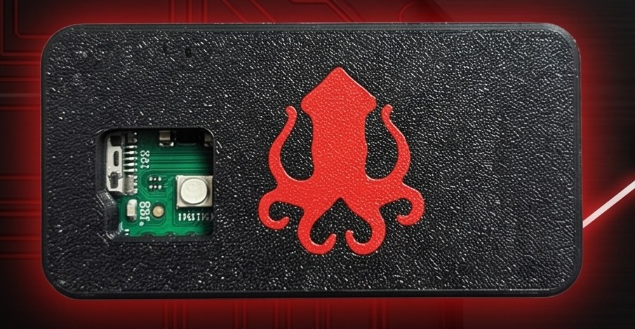

# 🦑 Kraken HID

**Scriptable USB keystroke-injection trainer — RP2040 Pico / ESP32-S2 Mini**

The **Kraken HID** is a hand-built USB keystroke-injection device from P01yg107 Labs. When you plug it in, the host computer sees an ordinary USB keyboard — so it can type a saved script faster than any human. It's a hands-on way to learn how computers trust USB input, and why you never leave a machine unlocked.

🛒 **Buy one:** https://p01ylabs.com  ·  ▶ **Demo:** https://youtu.be/SnixAl9j7GE  ·  🏷️ **$29.99**

> ⚠️ **For education and authorized testing only.** See [docs/SAFETY.md](docs/SAFETY.md).

---

## Specs

| | |
|---|---|
| Board | Raspberry Pi Pico (RP2040) or ESP32-S2 Mini |
| Firmware | pico-ducky (CircuitPython DuckyScript interpreter) |
| Connection | USB (Pico uses **Micro-USB** — use a **data** cable, not charge-only) |
| Scripting | DuckyScript, written with the free Mythoskull Payload Builder |
| Case | 3D-printed PETG-CF with a flush two-colour kraken inlay |

## Quick start

1. Plug the Kraken into a computer **you own** with a USB **data** cable.
2. It mounts as a small USB drive (the CircuitPython drive).
3. Open `payload.dd` on that drive in any text editor.
4. Paste a DuckyScript payload (see the harmless demo in docs/USAGE.md).
5. Save the file. The Kraken runs it the next time it's plugged in (or on reset).

Full walkthrough: **[docs/SETUP.md](docs/SETUP.md)** · Usage & examples: **[docs/USAGE.md](docs/USAGE.md)** · Problems: **[docs/TROUBLESHOOTING.md](docs/TROUBLESHOOTING.md)**

## Firmware & credits

- **[pico-ducky](https://github.com/dbisu/pico-ducky)** — the CircuitPython DuckyScript firmware the device runs
- **[Mythoskull Payload Builder](https://github.com/p0lygl07/KrakenPayloadBuilder)** — our free desktop app for writing DuckyScript payloads

This repo is the product documentation and companion material. Where upstream firmware is
used, please support and star the upstream project; firmware issues belong upstream.

## About P01yg107 Labs

Hand-built hardware for people learning offensive security. Every device is flashed and
bench-tested before it ships.

🌐 https://p01ylabs.com  ·  🐙 https://github.com/p0lygl07

---

© 2026 Joshua Burton (P01yg107 Labs). Documentation and original files licensed under the MIT License (see [LICENSE](LICENSE)).
Any upstream firmware remains the property of its respective authors, under their own licenses.
